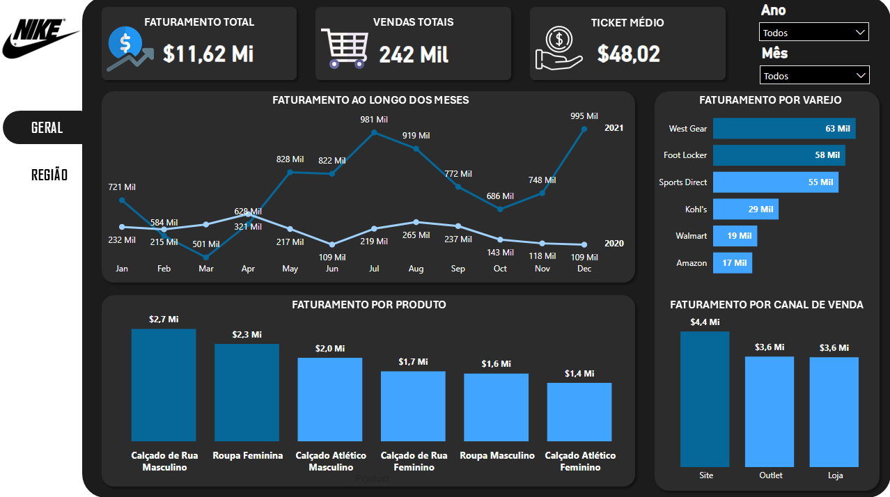
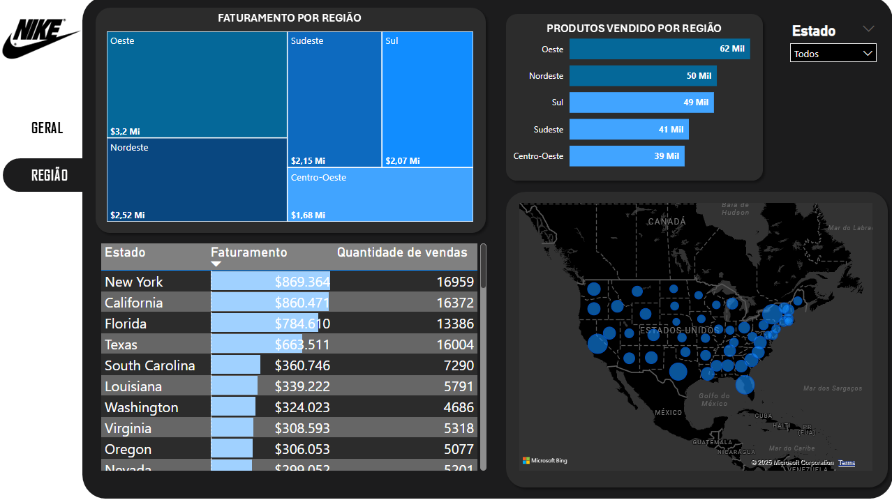

# Analise de dados vendas

DASHBOARD DE VENDAS

  

  

1. Qual é a receita total e a receita em 2020 e 2021?

|  Ano  |   Receita    |
| ----- | ------------ |
| 2020  | $ 2.432.744  |
| 2021  | $ 9.186.402  |
|**Total**|**$ 11.619.146**|

2. Ranking de produtos vendidos

| Produto | Quantidade Vendida | Receita Total |
|----------------|------------------|--------------|
| Calçado de Rua Masculino   | 57.737 | $ 2.667.814  | 
| Roupa Feminina             | 42.356 | $ 2.311.841  |
| Calçado Atlético Masculino | 42.429 | $ 1.982.704  |
| Calçado de Rua Feminino    | 38.309 | $ 1.661.186  |
| Roupa Masculino            | 30.085 | $ 1.607.586  |
| Calçado Atlético Feminino  | 38.309 | $ 1.388.015  |

3. Receita por região

|  Região  |   Receita    |
| -------- | ------------ |
| Oeste    | $ 3.202.508  |
| Nordeste | $ 2.522.866  |
| Sudeste  | $ 2.146.287  |
| Sul      | $ 2.069.055  |
| Centro-Oeste | $ 1.678.430  |

4. Top 5 Estados com mais lucros em 2020 e 2021

|  Estado  |   Receita    |
| -------- | ------------ |
| New York   | $ 869.364  |
| California | $ 860.471  |
| Florida    | $ 784.610  |
| Texas      | $ 663.511  |
| South Carolina | $ 360.746  |

5. Desempenho de receita pelos canais de vendas em 2020 e 2021

| Canal de Venda | Quantidade Vendida | Receita Total | % |
|----------------|------------------|--------------|--------|
| Site           | 92.877           | $ 4.426.126  | 38,09% |
| Outlet         | 79.706           | $ 3.607.110  | 31,04% |
| Loja           | 69.401           | $ 3.585.910  | 30,86% |

6. Desempenho da receita pelos varejistas

| Varejistas | Quantidade Vendida | Receita Total | % |
|---------------|------------------|--------------|------|
| West Gear     | 62831            | $ 3.256.181  | 28,02% |
| Foot Locker   | 58288            | $ 2.753.775  | 23,79% |
| Sports Direct | 55293            | $ 2.429.585  | 20,91% |
| Kohl's        | 28876            | $ 1.357.524  | 11,68% |
| Walmart       | 19449            | $ 970.238    | 8,35%  |
| Amazon        | 17247            | $ 851.843    | 7,33%  |
